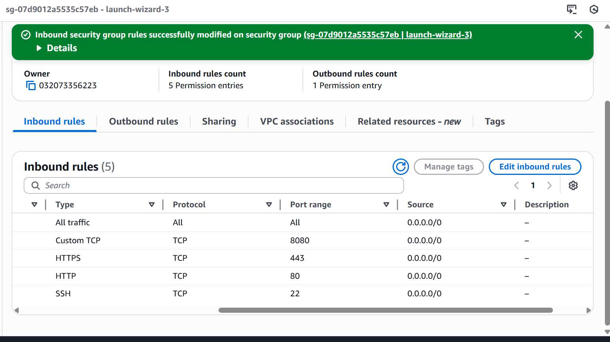
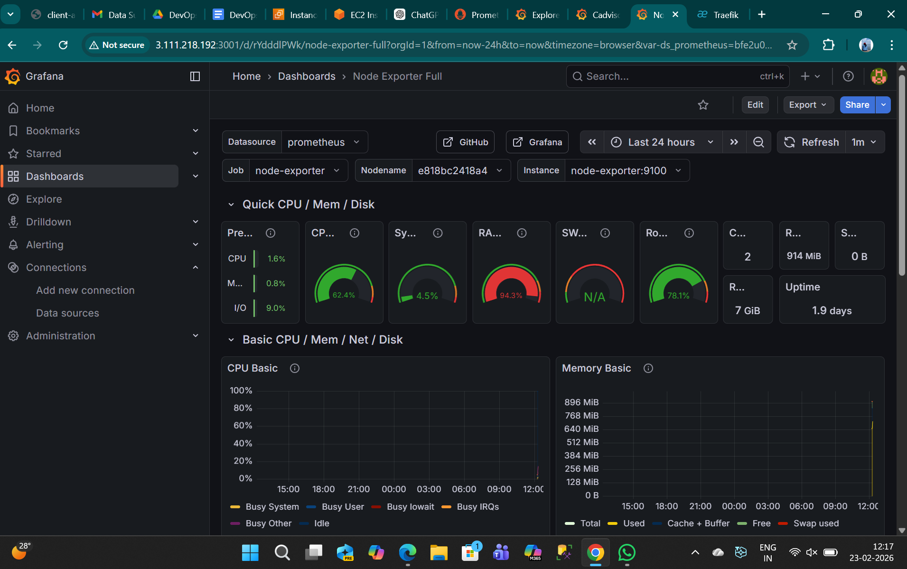
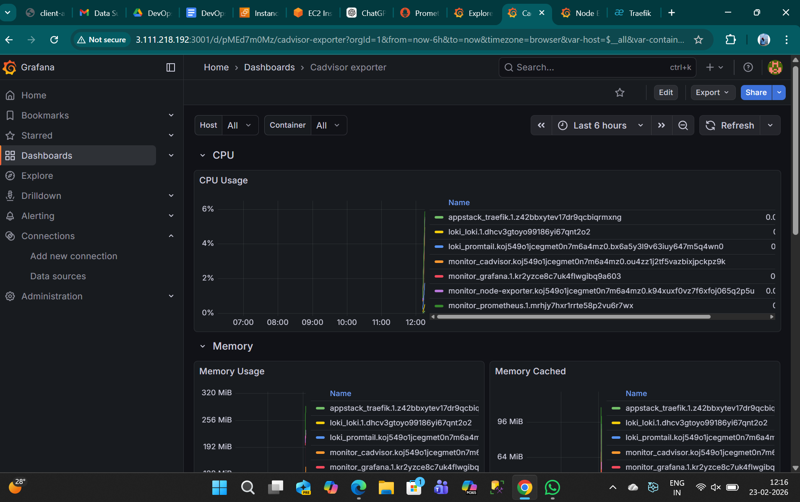
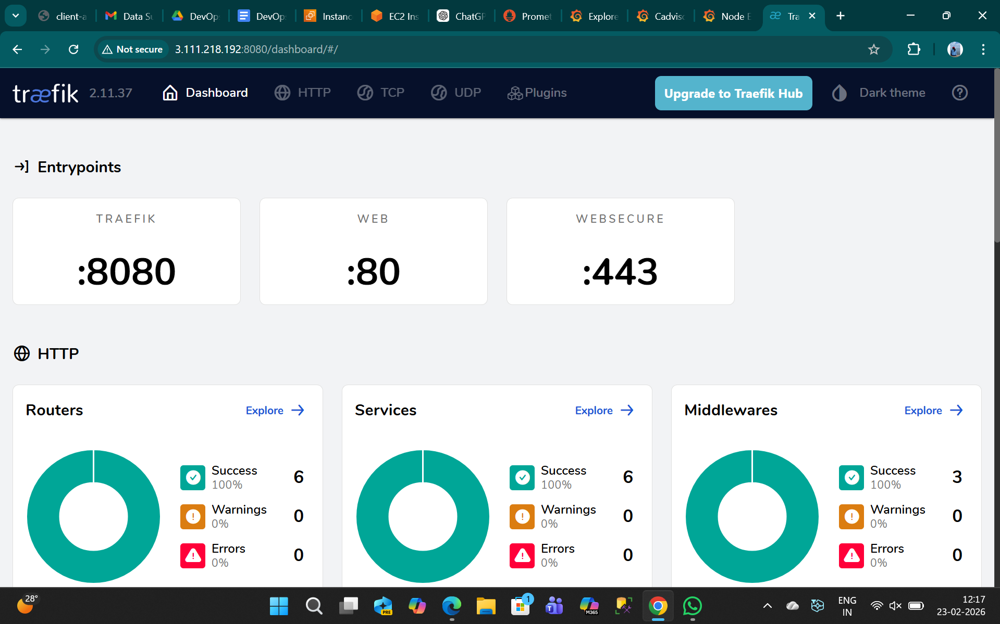
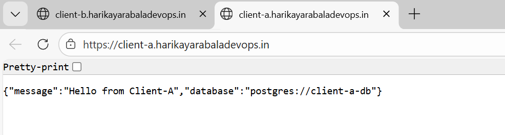
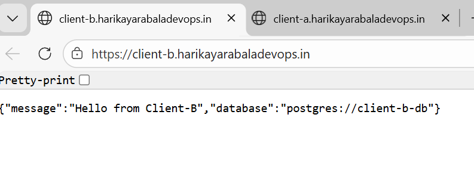

                    +----------------------+
                    |    Users / Browser   |
                    +----------+-----------+
                               |
                          HTTP/HTTPS
                               |
                    +----------v-----------+
                    |   Traefik (Ingress)  |
                    |  Host-based routing  |
                    +----+------------+----+
                         |            |
             client-a.*  |            |  client-b.*
                         |            |
           +-------------v--+     +---v--------------+
           | Client-A Node   |     | Client-B FastAPI |
           | replicas: 3     |     | replicas: 3      |
           +-----------------+     +------------------+

           # Multi-Client Docker Swarm on AWS EC2 (Traefik + Prometheus + Grafana + Loki)

This repo demonstrates a **multi-client** deployment on **AWS EC2** using **Docker Swarm**, supporting:
- Multiple services (Node.js + FastAPI)
- Client-specific routing via **Traefik**
- Horizontal scaling (replicas)
- Basic monitoring (**Prometheus + Node Exporter + cAdvisor + Grafana**)
- Centralized logging (**Loki + Promtail + Grafana**)

---

## ✅ What’s deployed

### Client Apps
- **Client-A**: Node.js REST API  
  Route: `client-a.<your-domain>` → Node service
- **Client-B**: Python FastAPI  
  Route: `client-b.<your-domain>` → FastAPI service

Each client has:
- Separate env variables
- Separate DB connection string (example values)

### Reverse Proxy
- **Traefik** (routes & load-balances across replicas)

### Monitoring
- Prometheus targets:
  - `prometheus`
  - `node-exporter`
  - `cadvisor`
- Grafana dashboards (Node Exporter + cAdvisor)

### Logging
- Loki + Promtail (container logs visible in Grafana Explore)

---

## 🧱 Architecture (high level)

Users → Traefik (80/443) → Swarm services (replicas)  
Monitoring: Prometheus scrapes node-exporter + cAdvisor  
Logging: Promtail → Loki → Grafana Explore

---

## 📌 Prerequisites

### On AWS
- 1 Manager + 1 Worker EC2 (Ubuntu recommended)
- Security Group open:
  - `22` (SSH)
  - `80` (HTTP)
  - `443` (HTTPS)
  - `8080` (Traefik dashboard - optional)
  - `9090` (Prometheus - optional)
  - `3000` (Grafana - optional)

### On both nodes
- Docker installed
- Swarm initialized

---

## 🚀 Setup Docker Swarm

### 1) On Manager
```bash
docker swarm init


##🌐 DNS / Domain Setup

Create DNS A records pointing to your EC2 public IP:

client-a.<your-domain> → <EC2_PUBLIC_IP>

client-b.<your-domain> → <EC2_PUBLIC_IP>

Example:

client-a.harikayarabaladevops.in

client-b.harikayarabaladevops.in


📦 Deploy the Stack

On the manager node:
git clone https://github.com/harikayarabala/multi-client-swarm.git
cd multi-client-swarm
docker stack deploy -c stack.yml appstack

Check services:
docker service ls
docker stack ps appstack

✅ Validate Routing (Client Apps)
Option 1: Using domains in browser

http(s)://client-a.<your-domain>

http(s)://client-b.<your-domain>

Expected JSON like:
{"message":"Hello from Client-A","database":"postgres://client-a-db"}
{"message":"Hello from Client-B","database":"postgres://client-b-db"}

Option 2: Using curl with Host header (best for testing)
curl -i http://<EC2_PUBLIC_IP>/ -H "Host: client-a.<your-domain>"
curl -i http://<EC2_PUBLIC_IP>/ -H "Host: client-b.<your-domain>"

Scaling (replicas)

Scale Client-A:

docker service scale appstack_client-a-node=3

Scale Client-B:

docker service scale appstack_client-b-python=3

Verify:

docker service ps appstack_client-a-node
docker service ps appstack_client-b-python
🔁 Rolling Update (Zero downtime)

Update image (example):

docker service update \
  --image <your-image>:<new-tag> \
  --update-parallelism 1 \
  --update-delay 10s \
  appstack_client-a-node

Swarm ensures availability by:

Updating replicas gradually (parallelism=1)

Keeping old replicas running until new ones are healthy

Rescheduling tasks on failure


Monitoring
Prometheus

Targets page:

http://<EC2_PUBLIC_IP>:9090/targets

Grafana

http://<EC2_PUBLIC_IP>:3000

Check dashboards:

Node Exporter Full

cAdvisor / Container metrics

🧾 Logging (Loki)

Grafana → Explore → Loki

Example query:

{job="docker"}

You should see container logs for services like:

traefik

promtail

loki

client-a / client-b apps


🧰 Useful Commands

Service logs:

docker service logs -f appstack_client-a-node
docker service logs -f appstack_client-b-python

Traefik dashboard:

http://<EC2_PUBLIC_IP>:8080/dashboard#/

List networks:

docker network ls

Cleanup

Remove stack:

docker stack rm appstack

(Optional) leave swarm:

docker swarm leave --force

🧠 Notes / Multi-client expansion plan

---

## 🧠 Multi-Client Architecture Thinking (20 new clients/month)

If 20 new clients are onboarded monthly, the solution should be designed to scale safely without duplicating infrastructure unnecessarily.

### 1) Networking Strategy
- Use **one shared Swarm overlay network** for app traffic (Traefik → services).
- Use a **separate overlay network** for observability (Prometheus/Grafana/Loki).
- Route traffic using **host-based routing** (e.g., `client-<id>.domain.com`) via Traefik labels.
- Keep internal service-to-service traffic private inside overlay networks.

### 2) Image Versioning Strategy
- Build once, deploy many: use the **same base image** for all clients when code is same.
- Tag images with:
  - `:<commit-sha>` for immutable releases
  - `:vX.Y.Z` for stable versions
- If a client needs customization, maintain:
  - `client-a:<version>` (client-specific image) OR
  - feature flags/env-based behavior (preferred if possible).

### 3) Secrets Management
- Store client-specific values using **Docker Swarm secrets**:
  - DB URL, API keys, credentials
- Use naming convention:
  - `client-a-db-url`, `client-b-db-url`
- For larger scale, integrate external secret store:
  - AWS SSM Parameter Store / Secrets Manager (optional enhancement)

### 4) Scaling Strategy
- Default: **replicas per service** (ex: 3) for high availability.
- Scale per client based on traffic:
  - `docker service scale appstack_client-a-node=5`
- Use resource limits/reservations to prevent noisy neighbor issues.
- Prefer rolling updates with:
  - `update_config: parallelism: 1`
  - `delay: 10s`
  - `restart_policy: on-failure`

### 5) Cost Optimization
- Prefer **shared cluster** for small/medium clients to reduce EC2 cost.
- Create separate clusters only for:
  - high-security clients
  - heavy workloads
  - strict isolation requirements
- Use spot instances for workers (if allowed) and on-demand for manager nodes.

### 6) Shared Cluster vs Per-Client Stack
- **Shared cluster + per-client services** (recommended):
  - cheaper, easier to operate
  - best for many similar clients
- **Per-client stack**:
  - stronger isolation
  - higher cost and operational overhead

### 7) Resource Constraints & Isolation
- Use Swarm node labels + placement constraints:
  - `node.labels.role==apps`
  - `node.labels.role==monitoring`
  - `node.labels.client==premium`
- Keep observability components on dedicated nodes if needed.

### 8) EC2 Auto-Scaling (Future Enhancement)
- Add more worker nodes when CPU/memory crosses threshold:
  - ASG for worker nodes (recommended)
  - Keep manager node(s) stable
- Rebalance workloads automatically since Swarm reschedules tasks on available nodes.

---

Use CI/CD tagging strategy: app:<commit-sha> per release
Evidence (Screenshots)

## 📎 Evidence (Screenshots)

### Prometheus Targets


### Grafana Logs


### Node Exporter Dashboard


### cAdvisor Dashboard


### Traefik Dashboard


### Client-A Response


### Client-B Response

